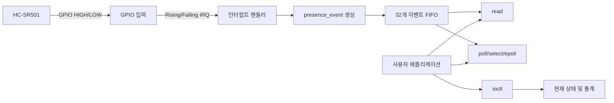

# HC-SR501 PIR Linux Device Driver

HC-SR501 PIR 인체 감지 센서를 위한 Linux 커널 문자 디바이스 드라이버입니다.

GPIO 인터럽트를 이용해 센서 상태 변화를 감지하고, 발생한 이벤트를 내부 FIFO에 저장합니다. 사용자 애플리케이션은 `read()`, `poll()`, `select()`, `epoll()`, `ioctl()`을 통해 센서 이벤트와 상태 정보를 받을 수 있습니다.

---

## 주요 기능

* HC-SR501 GPIO 입력 처리
* 상승 에지와 하강 에지 인터럽트 감지
* 센서 이벤트를 FIFO에 저장
* Blocking 및 Non-blocking `read()` 지원
* `poll()`, `select()`, `epoll()` 지원
* `ioctl()`을 이용한 상태 및 통계 조회
* 이벤트 발생 시간 기록
* 이벤트 순서 번호 관리
* FIFO 오버플로 감지
* 단일 사용자 프로그램만 장치 열기 허용
* 모듈 파라미터를 이용한 GPIO 번호 변경

---

## 동작 구조



센서 출력이 변경되면 다음 순서로 처리됩니다.

1. GPIO 상승 또는 하강 인터럽트가 발생합니다.
2. 인터럽트 핸들러가 현재 GPIO 값을 읽습니다.
3. 이벤트 종류와 발생 시간을 기록합니다.
4. 이벤트 순서 번호를 증가시킵니다.
5. 생성한 이벤트를 내부 FIFO에 저장합니다.
6. `read()` 또는 `poll()`에서 대기 중인 애플리케이션을 깨웁니다.
7. 애플리케이션이 FIFO에서 이벤트를 읽습니다.

---

## 장치 정보

| 항목         | 값              |
| ---------- | -------------- |
| 장치 이름      | `pir_dev`      |
| 장치 파일      | `/dev/pir_dev` |
| Major 번호   | `230`          |
| 기본 GPIO 번호 | `529`          |
| FIFO 크기    | 이벤트 32개        |
| 센서 종류      | HC-SR501 PIR   |
| 라이선스       | GPL-2.0        |

드라이버는 `register_chrdev()`를 사용해 Major 번호 `230`으로 문자 디바이스를 등록합니다.

현재 드라이버는 `class_create()`와 `device_create()`를 사용하지 않기 때문에 `/dev/pir_dev` 장치 파일을 자동으로 생성하지 않습니다.

장치 파일이 없다면 직접 생성해야 합니다.

```bash
sudo mknod /dev/pir_dev c 230 0
sudo chmod 666 /dev/pir_dev
```

현재 코드에서는 Minor 번호에 따라 기능을 구분하지 않으므로 일반적으로 Minor 번호 `0`을 사용할 수 있습니다.

---

## GPIO 설정

기본 GPIO 번호는 다음과 같이 설정되어 있습니다.

```c
static int pir_gpio = 529;
```

현재 테스트 환경에서는 다음 계산을 사용합니다.

```text
gpiochip base 512 + BCM GPIO17 = Global GPIO 529
```

즉, HC-SR501의 `OUT` 핀은 Raspberry Pi의 BCM GPIO17에 연결하고, 드라이버에는 Global GPIO 번호 `529`를 전달합니다.

### 연결 예시

| HC-SR501 | Raspberry Pi |
| -------- | ------------ |
| VCC      | 5V           |
| OUT      | BCM GPIO17   |
| GND      | GND          |

> GPIO 번호는 커널과 GPIO Chip의 Base 번호에 따라 달라질 수 있습니다.

현재 GPIO Chip 정보를 확인하려면 다음 명령을 사용할 수 있습니다.

```bash
gpioinfo
```

또는 디버그 파일 시스템에서 확인할 수 있습니다.

```bash
sudo cat /sys/kernel/debug/gpio
```

---

## 모듈 파라미터

`pir_gpio`는 커널 모듈 파라미터로 등록되어 있습니다.

```c
module_param(pir_gpio, int, 0444);
```

따라서 모듈을 삽입할 때 GPIO 번호를 변경할 수 있습니다.

```bash
sudo insmod pir_dev.ko pir_gpio=529
```

다른 Global GPIO 번호를 사용한다면 다음과 같이 변경합니다.

```bash
sudo insmod pir_dev.ko pir_gpio=<GPIO 번호>
```

모듈이 로드된 후 현재 설정값을 확인할 수 있습니다.

```bash
cat /sys/module/pir_dev/parameters/pir_gpio
```

---

## 인터럽트 처리

드라이버는 GPIO의 상승 에지와 하강 에지를 모두 감지합니다.

```c
IRQF_TRIGGER_RISING | IRQF_TRIGGER_FALLING
```

### 상승 에지

센서 출력이 `LOW → HIGH`로 변경된 경우입니다.

```text
event_type = PRESENCE_EVENT_ASSERTED
raw_value = 1
```

일반적으로 HC-SR501이 움직임을 감지한 상태를 의미합니다.

### 하강 에지

센서 출력이 `HIGH → LOW`로 변경된 경우입니다.

```text
event_type = PRESENCE_EVENT_DEASSERTED
raw_value = 0
```

일반적으로 HC-SR501의 감지 출력이 해제된 상태를 의미합니다.

---

## 이벤트 데이터

각 GPIO 인터럽트가 발생하면 `struct presence_event` 형식의 이벤트가 생성됩니다.

드라이버에서 사용하는 주요 필드는 다음과 같습니다.

| 필드             | 설명                   |
| -------------- | -------------------- |
| `api_version`  | UAPI 버전              |
| `sensor_type`  | 센서 종류                |
| `event_type`   | 감지 또는 감지 해제 이벤트      |
| `timestamp_ns` | 이벤트 발생 시간            |
| `raw_value`    | GPIO 원시 값 `0` 또는 `1` |
| `sequence`     | 이벤트 순서 번호            |
| `flags`        | 이벤트 누락 등의 상태 플래그     |

이벤트 발생 시간은 다음 커널 함수를 사용하여 나노초 단위로 기록합니다.

```c
ktime_get_ns()
```

---

## FIFO

인터럽트 컨텍스트에서 생성된 이벤트는 드라이버 내부의 원형 FIFO에 저장됩니다.

```c
#define PIR_FIFO_DEPTH 32U
```

FIFO 관리에 사용되는 값은 다음과 같습니다.

| 변수           | 설명             |
| ------------ | -------------- |
| `fifo_head`  | 다음 이벤트를 저장할 위치 |
| `fifo_tail`  | 다음 이벤트를 읽을 위치  |
| `fifo_count` | 현재 저장된 이벤트 개수  |
| `fifo`       | 이벤트 저장 배열      |

FIFO에는 최대 32개의 이벤트를 저장할 수 있습니다.

### FIFO가 가득 찬 경우

FIFO가 가득 찬 상태에서 새로운 이벤트가 발생하면 가장 오래된 이벤트를 제거합니다.

```text
가장 오래된 이벤트 제거
→ dropped_events 증가
→ 새 이벤트에 DROPPED_BEFORE 플래그 설정
→ 새 이벤트 저장
```

이벤트 누락이 발생한 경우 다음에 전달되는 이벤트에 아래 플래그가 설정됩니다.

```c
PRESENCE_EVENT_FLAG_DROPPED_BEFORE
```

이를 통해 사용자 애플리케이션은 이전 이벤트가 유실되었다는 사실을 확인할 수 있습니다.

---

## `open()`

장치 파일을 열면 `pir_open()`이 호출됩니다.

```c
open("/dev/pir_dev", O_RDONLY);
```

드라이버는 동시에 하나의 애플리케이션만 장치를 열 수 있도록 제한합니다.

```c
atomic_cmpxchg(&pir_dev.reader_open, 0, 1)
```

이미 다른 프로그램이 장치를 열고 있다면 다음 오류가 반환됩니다.

```text
-EBUSY
```

장치가 성공적으로 열리면 드라이버 데이터 주소가 다음 위치에 저장됩니다.

```c
filp->private_data = &pir_dev;
```

이후 `read()`, `poll()`, `ioctl()`에서 동일한 장치 데이터를 사용할 수 있습니다.

---

## `read()`

`read()`는 FIFO에 저장된 `presence_event` 한 개를 사용자 공간으로 전달합니다.

```c
read(fd, &event, sizeof(event));
```

반환값은 성공 시 다음과 같습니다.

```c
sizeof(struct presence_event)
```

### Blocking 모드

일반적인 방식으로 장치를 열면 Blocking 모드로 동작합니다.

```c
open("/dev/pir_dev", O_RDONLY);
```

FIFO에 이벤트가 없다면 `read()`는 다음 Wait Queue에서 대기합니다.

```c
wait_event_interruptible()
```

센서 인터럽트가 발생하면 인터럽트 핸들러가 다음 함수를 호출해 대기 중인 프로세스를 깨웁니다.

```c
wake_up_interruptible()
```

### Non-blocking 모드

장치를 `O_NONBLOCK`으로 열 수 있습니다.

```c
open("/dev/pir_dev", O_RDONLY | O_NONBLOCK);
```

FIFO에 이벤트가 없으면 기다리지 않고 다음 오류를 반환합니다.

```text
-EAGAIN
```

### 버퍼 크기

사용자가 전달한 버퍼가 이벤트 구조체보다 작으면 다음 오류를 반환합니다.

```text
-EINVAL
```

```c
if (count < sizeof(struct presence_event))
    return -EINVAL;
```

### 사용자 공간 복사 실패

`copy_to_user()`가 실패하면 다음 오류를 반환합니다.

```text
-EFAULT
```

해당 이벤트는 이미 FIFO에서 제거된 상태이므로 드라이버는 이를 누락된 이벤트로 기록합니다.

---

## `poll()`, `select()`, `epoll()`

드라이버는 이벤트 기반 대기를 지원합니다.

```c
.poll = pir_poll
```

애플리케이션이 `poll()`을 호출하면 드라이버는 Wait Queue에 애플리케이션을 등록합니다.

```c
poll_wait(filp, &dev->read_wait, wait);
```

FIFO에 읽을 이벤트가 있으면 다음 플래그를 반환합니다.

```c
EPOLLIN | EPOLLRDNORM
```

사용자 프로그램은 반복적으로 GPIO 상태를 확인하는 Busy Polling 없이 센서 이벤트가 발생할 때까지 대기할 수 있습니다.

### 동작 예시

```text
poll()에서 대기
        ↓
GPIO 인터럽트 발생
        ↓
이벤트를 FIFO에 저장
        ↓
wake_up_interruptible()
        ↓
poll() 반환
        ↓
read()로 이벤트 읽기
```

---

## `ioctl()`

`ioctl()`은 이벤트를 읽는 기능 외에 드라이버의 버전, 기능, 현재 상태, 통계 정보를 조회하는 데 사용됩니다.

```c
.unlocked_ioctl = pir_ioctl
```

잘못된 Magic Number 또는 지원하지 않는 명령이 전달되면 다음 오류를 반환합니다.

```text
-ENOTTY
```

### 지원 명령

| ioctl 명령                       | 설명          |
| ------------------------------ | ----------- |
| `PRESENCE_IOC_GET_API_VERSION` | UAPI 버전 조회  |
| `PRESENCE_IOC_GET_CAPS`        | 드라이버 기능 조회  |
| `PRESENCE_IOC_GET_STATE`       | 현재 센서 상태 조회 |
| `PRESENCE_IOC_GET_STATS`       | 이벤트 통계 조회   |
| `PRESENCE_IOC_CLEAR_STATS`     | 이벤트 통계 초기화  |

---

### API 버전 조회

```c
PRESENCE_IOC_GET_API_VERSION
```

현재 드라이버가 사용하는 `PRESENCE_API_VERSION` 값을 사용자 공간으로 전달합니다.

```c
__u32 version;

ioctl(fd, PRESENCE_IOC_GET_API_VERSION, &version);
```

---

### 기능 조회

```c
PRESENCE_IOC_GET_CAPS
```

드라이버가 지원하는 기능과 이벤트 구조체 크기, FIFO 크기를 반환합니다.

현재 코드에서 설정하는 기능은 다음과 같습니다.

```c
PRESENCE_CAP_READ
PRESENCE_CAP_POLL
PRESENCE_CAP_CURRENT_STATE
PRESENCE_CAP_STATS
PRESENCE_CAP_RISING_EDGE
PRESENCE_CAP_SINGLE_READER
```

반환되는 주요 정보는 다음과 같습니다.

| 항목                 | 설명         |
| ------------------ | ---------- |
| `api_version`      | API 버전     |
| `sensor_type`      | PIR 센서     |
| `capability_flags` | 지원 기능 비트   |
| `event_size`       | 이벤트 구조체 크기 |
| `fifo_depth`       | FIFO 최대 크기 |

---

### 현재 상태 조회

```c
PRESENCE_IOC_GET_STATE
```

현재 GPIO 상태와 마지막 이벤트 정보를 반환합니다.

| 항목                  | 설명            |
| ------------------- | ------------- |
| `raw_value`         | 현재 GPIO 값     |
| `sequence`          | 마지막 이벤트 순서 번호 |
| `last_timestamp_ns` | 마지막 이벤트 발생 시간 |
| `sensor_type`       | 센서 종류         |
| `api_version`       | API 버전        |

```c
struct presence_state state;

ioctl(fd, PRESENCE_IOC_GET_STATE, &state);
```

---

### 통계 조회

```c
PRESENCE_IOC_GET_STATS
```

드라이버가 기록한 이벤트 통계를 반환합니다.

| 통계                  | 설명                          |
| ------------------- | --------------------------- |
| `total_events`      | 인터럽트로 생성된 전체 이벤트 수          |
| `delivered_events`  | 사용자에게 정상 전달된 이벤트 수          |
| `dropped_events`    | FIFO 초과 또는 복사 실패로 누락된 이벤트 수 |
| `last_timestamp_ns` | 마지막 이벤트 발생 시간               |

```c
struct presence_stats stats;

ioctl(fd, PRESENCE_IOC_GET_STATS, &stats);
```

---

### 통계 초기화

```c
PRESENCE_IOC_CLEAR_STATS
```

다음 통계값을 모두 `0`으로 초기화합니다.

```text
total_events
delivered_events
dropped_events
stats_last_timestamp_ns
```

센서의 현재 상태, 이벤트 순서 번호, FIFO에 저장된 이벤트는 초기화하지 않습니다.

---

## 동기화 처리

이 드라이버는 인터럽트 핸들러와 사용자 프로세스가 같은 데이터를 동시에 접근할 수 있기 때문에 동기화 기능을 사용합니다.

### Spinlock

FIFO와 상태 및 통계 데이터 보호에 사용합니다.

```c
spinlock_t lock;
```

인터럽트 컨텍스트에서도 접근하기 때문에 다음 함수를 사용합니다.

```c
spin_lock_irqsave()
spin_unlock_irqrestore()
```

### Wait Queue

이벤트가 없을 때 `read()`와 `poll()`을 대기시키기 위해 사용합니다.

```c
wait_queue_head_t read_wait;
```

### Atomic 변수

장치를 한 프로그램만 열 수 있도록 관리합니다.

```c
atomic_t reader_open;
```

---

## 주요 함수

| 함수                       | 설명                     |
| ------------------------ | ---------------------- |
| `pir_module_init()`      | GPIO, IRQ, 문자 디바이스 초기화 |
| `pir_module_exit()`      | 문자 디바이스, IRQ, GPIO 해제  |
| `pirIntHandler()`        | GPIO 인터럽트 처리 및 이벤트 생성  |
| `pir_open()`             | 장치 열기 및 단일 Reader 검사   |
| `pir_read()`             | FIFO에서 이벤트 읽기          |
| `pir_poll()`             | 이벤트 발생 대기 지원           |
| `pir_ioctl()`            | 상태, 기능 및 통계 처리         |
| `pir_release()`          | 장치 닫기                  |
| `pirEventAvailable()`    | FIFO에 이벤트가 있는지 확인      |
| `pirMarkDroppedLocked()` | 이벤트 누락 상태 기록           |

---

## 초기화 과정

모듈을 삽입하면 `pir_module_init()`이 실행됩니다.

```text
Spinlock 초기화
        ↓
Wait Queue 초기화
        ↓
Reader 상태 초기화
        ↓
FIFO 초기화
        ↓
gpio_request()
        ↓
gpio_direction_input()
        ↓
현재 GPIO 상태 읽기
        ↓
gpio_to_irq()
        ↓
request_irq()
        ↓
register_chrdev()
```

초기화 중 오류가 발생하면 이미 확보한 자원을 역순으로 해제합니다.

예를 들어 문자 디바이스 등록에 실패하면 다음 순서로 정리합니다.

```text
free_irq()
gpio_free()
```

---

## 종료 과정

모듈을 제거하면 `pir_module_exit()`이 실행됩니다.

```text
unregister_chrdev()
        ↓
free_irq()
        ↓
gpio_free()
```

모듈 제거 명령은 다음과 같습니다.

```bash
sudo rmmod pir_dev
```

---

## 빌드에 필요한 파일

```text
HC-SR501-driver/
├── pir_dev.c
├── presence_uapi.h
└── Makefile
```

`presence_uapi.h`에는 다음 내용이 정의되어 있어야 합니다.

* API 버전
* ioctl Magic Number
* ioctl 명령
* 센서 종류
* 이벤트 종류
* 기능 플래그
* 이벤트 플래그
* `struct presence_event`
* `struct presence_caps`
* `struct presence_state`
* `struct presence_stats`

---

## Makefile 예시

```makefile
obj-m += pir_dev.o

KDIR ?= /lib/modules/$(shell uname -r)/build
PWD := $(shell pwd)

all:
	$(MAKE) -C $(KDIR) M=$(PWD) modules

clean:
	$(MAKE) -C $(KDIR) M=$(PWD) clean
```

빌드합니다.

```bash
make
```

빌드가 완료되면 다음 파일이 생성됩니다.

```text
pir_dev.ko
```

---

## 실행 방법

### 1. 커널 모듈 삽입

```bash
sudo insmod pir_dev.ko pir_gpio=529
```

### 2. 모듈 확인

```bash
lsmod | grep pir_dev
```

### 3. 커널 로그 확인

```bash
dmesg | tail
```

정상적으로 등록되면 다음과 비슷한 로그가 출력됩니다.

```text
pir_dev: module init
pir_dev: ready major=230 gpio=529 irq=<IRQ 번호>
```

### 4. 장치 파일 생성

```bash
sudo mknod /dev/pir_dev c 230 0
sudo chmod 666 /dev/pir_dev
```

### 5. 장치 파일 확인

```bash
ls -l /dev/pir_dev
```

### 6. 테스트 프로그램 실행

```bash
./pir_app
```

### 7. 모듈 제거

먼저 장치를 사용하는 프로그램을 종료한 후 모듈을 제거합니다.

```bash
sudo rmmod pir_dev
```

---

## 커널 로그

실시간으로 드라이버 로그를 확인할 수 있습니다.

```bash
sudo dmesg -w
```

장치를 열면 다음 로그가 출력됩니다.

```text
pir_dev: open major=230 minor=0
```

장치를 닫으면 다음 로그가 출력됩니다.

```text
pir_dev: release
```

모듈을 제거하면 다음 로그가 출력됩니다.

```text
pir_dev: module exit
```

---

## 주요 오류 코드

| 오류                     | 의미                                |
| ---------------------- | --------------------------------- |
| `-EBUSY`               | 다른 프로그램이 이미 장치를 열고 있음             |
| `-EINVAL`              | `read()` 버퍼 크기가 이벤트 구조체보다 작음      |
| `-EAGAIN`              | Non-blocking 모드에서 읽을 이벤트가 없음      |
| `-EFAULT`              | 사용자 공간 메모리 복사 실패                  |
| `-ENOTTY`              | 잘못된 ioctl 명령                      |
| `-ERESTARTSYS` 계열      | 대기 중 시그널 발생                       |
| `gpio_request()` 오류    | 해당 GPIO를 다른 드라이버가 사용 중이거나 번호가 잘못됨 |
| `request_irq()` 오류     | IRQ 요청 실패                         |
| `register_chrdev()` 오류 | Major 번호 등록 실패                    |

---

## 주의 사항

### GPIO 번호 확인

이 드라이버의 기본값 `529`는 테스트 환경의 Global GPIO 번호입니다.

다른 커널이나 다른 보드에서는 GPIO Chip의 Base 번호가 달라질 수 있으므로 반드시 현재 시스템의 GPIO 번호를 확인해야 합니다.

### Major 번호 충돌

Major 번호 `230`을 다른 문자 디바이스가 사용 중이면 등록에 실패할 수 있습니다.

```bash
cat /proc/devices
```

명령으로 현재 등록된 문자 디바이스를 확인할 수 있습니다.

### 단일 Reader

현재 드라이버는 동시에 한 개의 사용자 애플리케이션만 장치를 열 수 있습니다.

두 번째 프로그램이 장치를 열면 `EBUSY` 오류가 발생합니다.

### FIFO 크기

이벤트가 빠르게 발생하고 사용자 애플리케이션이 이벤트를 충분히 빨리 읽지 않으면 FIFO가 가득 찰 수 있습니다.

FIFO가 가득 차면 가장 오래된 이벤트가 삭제되고 `dropped_events`가 증가합니다.

### 자동 장치 파일 생성 미지원

현재 코드는 `class_create()`와 `device_create()`를 사용하지 않으므로 `/dev/pir_dev`를 직접 생성해야 합니다.

### 에지 Capability 확인

인터럽트는 상승 에지와 하강 에지를 모두 요청하지만, `PRESENCE_IOC_GET_CAPS`에서는 `PRESENCE_CAP_RISING_EDGE`만 설정합니다.

`presence_uapi.h`에 하강 에지 Capability가 정의되어 있다면 해당 플래그를 추가하는 것을 검토할 수 있습니다.

---

## 라이선스

```text
GPL-2.0
```

커널 모듈에는 다음 라이선스가 선언되어 있습니다.

```c
MODULE_LICENSE("GPL");
```

---

## 작성자

```text
ygy
```

```c
MODULE_AUTHOR("ygy");
MODULE_DESCRIPTION("HC-SR501 presence event driver");
```
